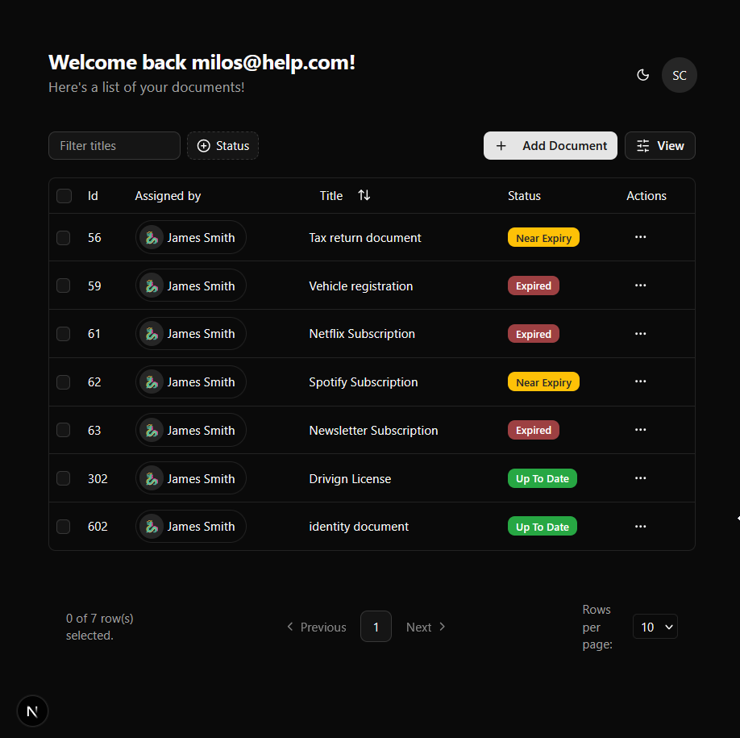
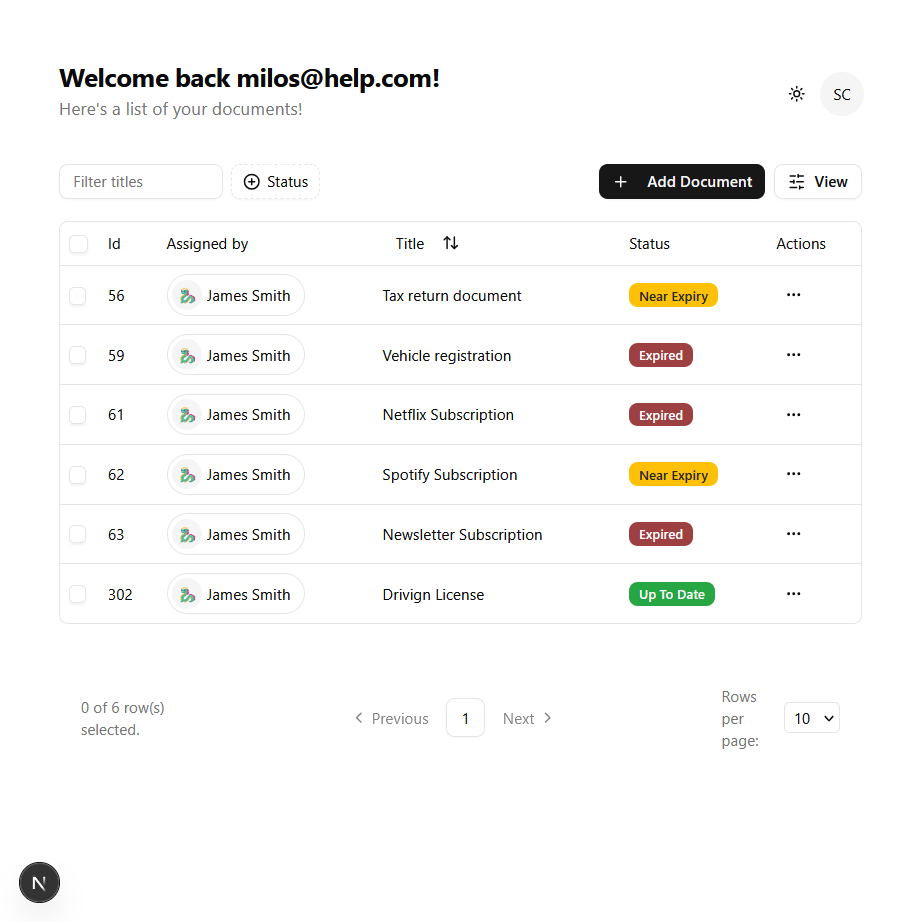
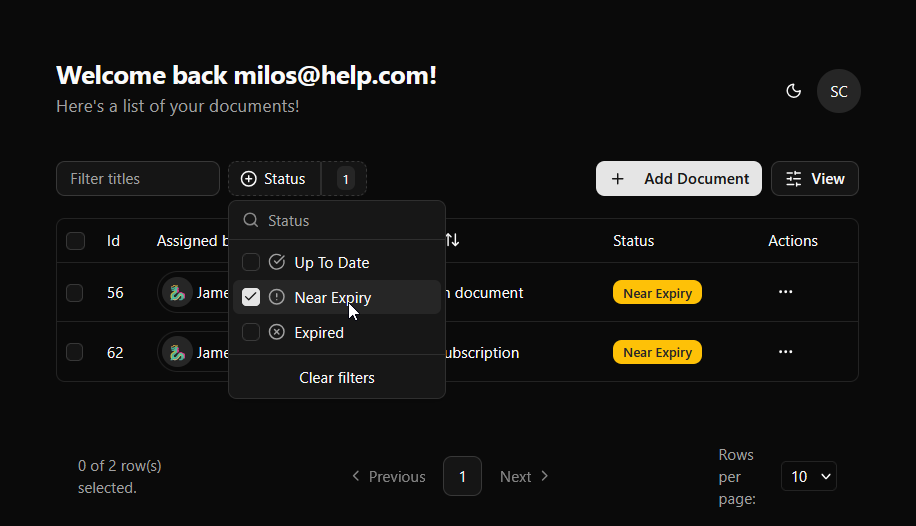
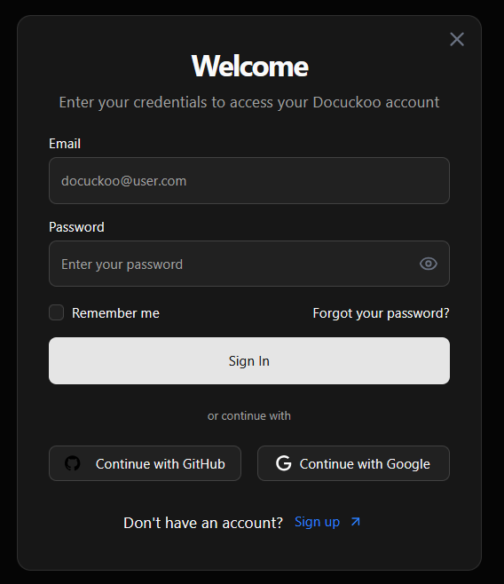
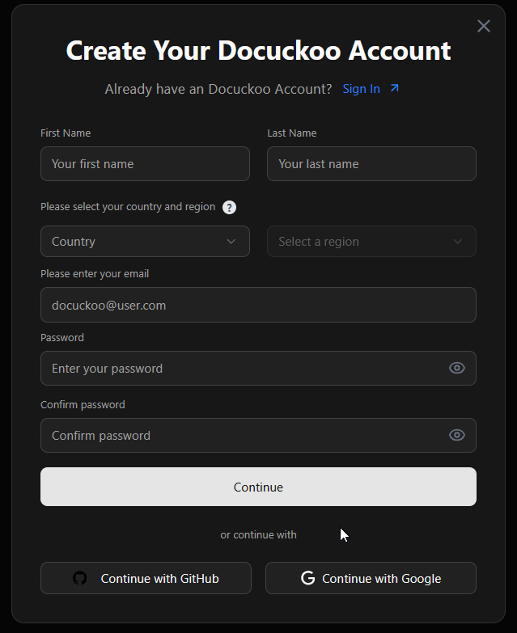

#  Disclaimer

This project is **nowhere near finished** and should **not** be used in production.
Its main purpose is **learning and experimentation**.  
It may contain **bugs** and **unfinished placeholder features**.  

Use it at your own risk.

# Getting Started

Stack: 

- **Frontend:** Next.js, React, Tailwind CSS, Node.js
- **Backend:** Java, Spring Boot, Gradle  

Clone the repository:

```bash
git clone <repo-url>
cd docuckoo-beta
```

## Database Setup (SQLite)

###  Windows

Download SQLite precompiled binaries:
https://www.sqlite.org/download.html

Extract to a folder (e.g., C:\sqlite) and add it to your Windows PATH.

Test installation:

```bash
sqlite3 --version # Check the version
```

### Linux / macOS

```bash
# Linux
sudo apt install sqlite3

# macOS
brew install sqlite
```

## Backend Setup
Requires Java 17+ installed.

```bash
./gradlew build    # build the project
./gradlew bootRun  # start Spring Boot server
```

Backend runs on http://localhost:8080

## Frontend Setup

Install dependencies:
```bash
npm install        
# or yarn install / pnpm install
```

Run the development server:

```bash
npm run dev
# or
yarn dev
# or
pnpm dev
# or
bun dev
```

Open [http://localhost:3000](http://localhost:3000) with your browser to see the result.

You can start editing the page by modifying `app/page.tsx`. The page auto-updates as you edit the file.

This project uses [`next/font`](https://nextjs.org/docs/app/building-your-application/optimizing/fonts) to automatically optimize and load [Geist](https://vercel.com/font), a new font family for Vercel.

## Learn More

To learn more about Next.js, take a look at the following resources:

- [Next.js Documentation](https://nextjs.org/docs) - learn about Next.js features and API.
- [Learn Next.js](https://nextjs.org/learn) - an interactive Next.js tutorial.

You can check out [the Next.js GitHub repository](https://github.com/vercel/next.js) - your feedback and contributions are welcome!

## Deploy on Vercel

The easiest way to deploy your Next.js app is to use the [Vercel Platform](https://vercel.com/new?utm_medium=default-template&filter=next.js&utm_source=create-next-app&utm_campaign=create-next-app-readme) from the creators of Next.js.

Check out our [Next.js deployment documentation](https://nextjs.org/docs/app/building-your-application/deploying) for more details.

## Screenshots






